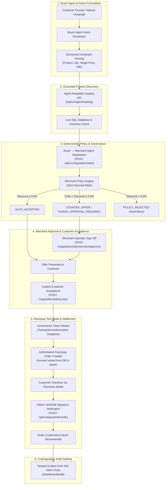

# APEX — Governed Agentic Commerce OS

> **Razorpay AI Buildathon Submission — Track 01: AI Growth & Agentic Commerce**  
> An AI-native commerce operating platform where AI agents discover and negotiate commerce, merchant policy strictly governs financial authority, customers explicitly authorize payment, and every state transition is cryptographically sealed on a tamper-evident SHA-256 audit ledger.

---

## ⚡ 30-Second Executive Summary

Traditional commerce platforms force human buyers and merchants to manually click through every step of discovery, discounting, cart management, and checkout. **Apex** introduces **Governed Agentic Commerce**:

- **Autonomous AI Buyer Agents** formulate structured shopping intents and negotiate machine-to-machine with merchants.
- **Merchant Revenue & Negotiation Agents** dynamically propose counters, bundles, and cross-sells grounded in real database inventory.
- **Deterministic Policy Engines** enforce hard discount ceilings, velocity limits, and mandatory human operator approval gates.
- **Razorpay Test Mode Integration** executes authoritative payment orders locked to server-verified Decimal amounts in minor units (paise) with HMAC-SHA256 signature verification.
- **Cryptographic Audit Ledger** records every intent, policy decision, approval, and payment attempt in an unbroken SHA-256 hash chain.

```
       Autonomous Commerce ≠ Autonomous Financial Authority
  AI Agents Reason & Propose  │  Deterministic Policy & Customer Authorize
```

---

## 🏗️ Core Architecture & Agentic Flow



---

## 🛡️ Governance & Security Boundary (Threat vs. Defense)

Apex strictly separates **AI reasoning** from **financial authority**. The browser and LLM are never trusted for monetary amounts, role privileges, or state transitions.

| Threat / Attack Vector | Attack Description | Apex Defense Mechanism | Enforcement Layer |
| :--- | :--- | :--- | :--- |
| **Client Price Tampering** | Attacker modifies checkout payload to `amount = ₹1.00`. | Server ignores client amount; pulls authoritative Decimal price directly from DB `TransactionAuthorization`. | `PaymentService` & `NegotiationEngine` |
| **Excessive AI Discount** | Buyer agent prompts merchant agent for 70% off. | Deterministic policy engine hard-rejects requests exceeding merchant discount ceiling (`max_discount_percent = 5.0%`). | `PolicyEngine` (Zero-LLM) |
| **Unauthorized Acceptance** | Attacker attempts to accept an offer belonging to another customer. | Server validates authenticated customer identity against offer `buyer_user_id`. | `AuthorizationService` |
| **Cross-Tenant Mutation** | Rogue Merchant B attempts to approve Merchant A's pending discount. | Multi-tenant session verification rejects cross-tenant IDs with `HTTP 400/403`. | `TenantGuard` |
| **Expired Offer Checkout** | Customer attempts checkout on a negotiated offer past 10-minute TTL. | Server state machine marks expired offers as terminal `EXPIRED`; checkout is blocked. | `NegotiationStateMachine` |
| **Inventory Desync** | Stock sells out during negotiation dialogue. | Pre-payment revalidation checks live active stock before minting `TransactionAuthorization`. | `InventoryService` |
| **Duplicate Payment** | Network lag causes double-click on payment button. | Idempotency keys (`idempotency_key`) and state machine terminal states prevent duplicate order creation. | `PaymentStateMachine` |
| **Audit Log Tampering** | Attacker modifies an event payload in database. | Each audit entry contains a SHA-256 hash of `prev_hash + payload`; chain breaks immediately if mutated. | `AuditService` |

---

## 💳 Razorpay Test Mode Integration

Apex demonstrates production-grade Razorpay payment integration configured in **Test Mode** for the competition environment:

- **Server-Authoritative Order Creation:** Backend invokes Razorpay API (`/orders`) with amount computed strictly in minor units (paise) from the database snapshot.
- **Cryptographic Signature Verification:** Upon checkout completion, the frontend returns `razorpay_order_id`, `razorpay_payment_id`, and `razorpay_signature`. The backend verifies HMAC-SHA256 signature using `RAZORPAY_KEY_SECRET` before transitioning the transaction to `CAPTURED`.
- **Active Reconciliation & State Machine:** Robust state machine transitions (`ORDER_CREATED` $\to$ `PAYMENT_PENDING` $\to$ `CAPTURED`). Ambiguous gateway timeouts transition to `UNKNOWN` and require active polling/reconciliation rather than blind retries.
- **No Client Price Manipulation:** Client request body amounts are ignored or asserted against server state; zero financial authority is delegated to the browser.

---

## 🌟 Key Product Capabilities

### 1. Autonomous AI Buyer Agent
- Natural language requirement parsing (e.g. *"I want 2 pairs of Pro Running Shoes for ₹6,400"*).
- Structured parameter extraction: product resolution, quantity, budget constraint, and currency.
- Grounded catalog search via `/api/v1/agent/catalog` with zero hallucinations.

### 2. Merchant Revenue & Negotiation Agent
- Evaluates buyer proposals against live catalog pricing and active stock velocity.
- Computes policy-bounded counter-offers (e.g. capping discount at 5% ceiling $\to$ ₹6,648.10 with ₹349.90 customer savings).
- Seamless escalation to human operator review queue when proposals exceed auto-acceptance bounds.

### 3. AI Growth & Cross-Sell Autopilot
- High-margin inventory awareness with grounded co-purchase affinity scoring (e.g. recommending dry-fit performance socks with running shoes).
- Real-time basket size uplift without rogue price mutations.

### 4. Ask Apex Grounded Merchant Intelligence
- Natural language merchant analytics interface directly backed by live SQL telemetry:
  - *"How can I increase revenue this week?"* $\to$ Margin-optimized bundling recommendations.
  - *"Find my best cross-sell opportunity"* $\to$ Affinity-scored complementary pairings.
  - *"Which products are at inventory risk?"* $\to$ Velocity-based stockout alerts.
  - *"Show me pending approvals"* $\to$ Governance queue review.

### 5. Dual Presentation Views
- **Human View:** Plain-language interactive timeline for shoppers and non-technical merchants.
- **Agent Protocol JSON View:** Machine-to-machine payload exchange containing trace IDs, policy decisions, and governance authorization tokens with sensitive API secrets redacted.

### 6. Apparel Virtual Try-On (VTO)
- Integrated with **FASHN VTON v1.5** for photorealistic apparel try-on.
- Deterministic eligibility gating: apparel items (T-shirts, hoodies, pants) are supported; non-apparel items (footwear, watches, accessories) return explicit unsupported explanations.

---

## 🎯 3-Minute Canonical Judge Walkthrough

Judges can experience the entire end-to-end agentic transaction on the canonical demo route:

### 🔗 **Entry Point:** [`/demo`](http://localhost:3000/demo)

1. **Start Live Demo:** Click `[START LIVE DEMO]`.
2. **AI Buyer Intent:** Buyer Agent parses *"2 pairs of Pro Running Shoes for ₹6,400"*.
3. **Policy Evaluation:** Policy engine evaluates ₹6,998 list price against 5.0% merchant discount policy.
4. **Counter-Offer:** Merchant Agent issues counter-offer of **₹6,648.10** (5.0% discount, ₹349.90 savings, 10-min TTL).
5. **Human Approval:** Merchant operator reviews and signs off via `[OPEN MERCHANT APPROVAL]`.
6. **Customer Acceptance:** Customer authorizes terms by clicking `[ACCEPT OFFER]`.
7. **Razorpay Checkout:** System mints `TransactionAuthorization` token and opens Razorpay Test Mode checkout for ₹6,648.10.
8. **Cryptographic Verification:** HMAC-SHA256 signature verification confirms order `ord_...` and transitions payment to `CAPTURED`.
9. **SHA-256 Audit Seal:** Click `[VIEW FULL TRACE]` to inspect the tamper-evident audit ledger.

### Secondary Judge Demonstration Scenarios:
- **Failure Demo (Blocked Negotiation):** Buyer requests 71.4% discount (₹2,000 for ₹6,998). Policy engine rejects the request; payment and order creation are strictly blocked.
- **Red-Team Tampering Defense:** Client injects `expected_amount = 1.00`. Backend ignores client payload and asserts ₹6,648.10 database snapshot amount.

---

## 🛠️ Technology Stack

| Layer | Technologies | Purpose |
| :--- | :--- | :--- |
| **Frontend** | Next.js 14 (App Router), React 18, TypeScript, TailwindCSS, Lucide Icons | Responsive merchant OS, customer storefront, and judge demo interface |
| **Backend** | FastAPI, Python 3.11+, Pydantic v2, SQLAlchemy, Uvicorn | High-performance asynchronous API, policy engine, and agent orchestration |
| **Database** | SQLite (Local/Dev/Test) / PostgreSQL-compatible architecture | Relational schema for products, offers, authorizations, and transactions |
| **Payments** | Razorpay Python SDK, Razorpay Checkout.js (Test Mode) | Server-side order creation, HMAC signature validation, and reconciliation |
| **AI / Agents** | Multi-Agent Orchestrator, LLM Gateway (OpenAI / LiteLLM / Mock) | Intent parsing, catalog discovery, cross-sell ranking, Ask Apex intelligence |
| **Security** | Python `hashlib` (SHA-256), `hmac`, JWT Auth, Role-Based Access Control | Cryptographic audit hash chains, signature verification, and tenant isolation |
| **Virtual Try-On** | FASHN VTON 1.5, PyTorch Local Inference Provider | Garment segmentation and photorealistic virtual try-on |

---

## 📡 API & Agent Protocol Specification

### Core Agent & Negotiation Endpoints
- `POST /api/v1/protocol/discover` — Grounded catalog discovery with budget, category, and availability filters.
- `POST /api/v1/negotiation/start` — Starts deterministic buyer ↔ merchant negotiation session.
- `GET  /api/v1/negotiation/{id}` — Retrieves live negotiation offer status and pricing breakdown.
- `POST /api/v1/negotiation/{id}/accept` — Customer acceptance of proposed or countered terms.
- `POST /api/v1/negotiation/{id}/merchant/approve` — Human merchant operator approval for escalated discounts.
- `POST /api/v1/negotiation/{id}/checkout` — Generates locked Razorpay order for accepted offer.
- `GET  /api/v1/negotiation/{id}/trace` — Retrieves complete cryptographic audit trail and SHA-256 hash.

### Payments & Governance Endpoints
- `GET  /api/v1/payments/config` — Returns public Razorpay key ID and mode (never leaks secrets).
- `POST /api/v1/payments/create-order` — Creates payment order verified against `TransactionAuthorization`.
- `POST /api/v1/payments/verify` — Validates HMAC-SHA256 signature for Razorpay Checkout response.
- `POST /api/v1/payments/{id}/reconcile` — Gateway polling reconciliation for ambiguous gateway states.

### Merchant Intelligence & VTO Endpoints
- `POST /api/v1/agents/merchant-growth/ask` — Ask Apex grounded merchant intelligence query.
- `POST /api/v1/virtual-tryon/check` — Deterministic eligibility check for apparel items.
- `POST /api/v1/virtual-tryon/jobs` — Creates and processes virtual try-on inference job.

---

## 🧪 Test Suite & Validation Evidence

The entire codebase is verified with strict automated regression, security, and integration suites:

```bash
cd backend && source venv/bin/activate
PYTHONPATH=. pytest -q
```

```
........................................................................ [ 13%]
............................s........................................... [ 27%]
........................................................................ [ 41%]
........................................................................ [ 54%]
........................................................................ [ 68%]
ss...................................................................... [ 82%]
.....s......s........................................................... [ 96%]
....................                                                     [100%]
519 passed, 5 skipped, 1 warning in 92.49s
```

- **Tests Collected:** **524 tests**
- **Tests Passed:** **519 passed** (100% of runnable suite passing)
- **Tests Skipped:** **5 skipped** (external live gateway dependencies requiring live network credentials)
- **Tests Failed:** **0 failed**
- **Frontend Production Build:** `npm run build` compiled **29/29 routes** cleanly with **0 TypeScript / Lint errors**.

---

## 📂 Project Structure

```
Apex-agentic-commerce-os/
├── README.md                      # Competition Master Documentation
├── .gitignore                     # Comprehensive credential & artifact exclusion
├── backend/                       # FastAPI Backend Application
│   ├── .env.example               # Safe environment variable template
│   ├── requirements.txt           # Python dependencies
│   ├── pytest.ini                 # Pytest configuration
│   ├── app/
│   │   ├── main.py                # Application entrypoint & middleware
│   │   ├── agents/                # AI Buyer, Merchant Growth, Negotiation Agents
│   │   ├── api/                   # REST API Routers (Negotiation, Payments, VTO, etc.)
│   │   ├── auth/                  # Authentication & Role-Based Access Control
│   │   ├── core/                  # Configuration & Security Settings
│   │   ├── database/              # SQLAlchemy Models (NegotiatedOffer, Auth, Orders)
│   │   ├── negotiation/           # Deterministic Negotiation Engine & State Machine
│   │   ├── payments/              # Razorpay Provider, Reconciliation & State Machine
│   │   ├── services/              # Audit, Inventory, Governance, VTO Services
│   │   └── schemas/               # Pydantic Request/Response Models
│   ├── scripts/                   # Seeding, verification & demo scripts
│   └── tests/                     # 524 Comprehensive Unit & Security Tests
└── frontend/                      # Next.js 14 Frontend Application
    ├── .env.example               # Safe frontend environment template
    ├── package.json               # Dependencies & scripts
    ├── tsconfig.json              # TypeScript strict configuration
    └── src/
        ├── app/
        │   ├── demo/              # Canonical Competition Judge Presentation (/demo)
        │   ├── shopping/          # Customer Marketplace & AI Storefront (/shopping)
        │   ├── dashboard/         # Merchant OS Control Center (/dashboard)
        │   └── auth/              # OAuth Callback & Authentication Handlers
        ├── components/            # Reusable UI components & modals
        └── lib/                   # API client & Razorpay script loaders
```

---

## 🚀 Local Development Setup

### 1. Backend Setup

```bash
cd backend
python3 -m venv venv
source venv/bin/activate
pip install -r requirements.txt

# Copy example environment configuration
cp .env.example .env

# Seed initial catalog (1,959 grounded SKUs)
python3 scripts/seed.py

# Start FastAPI backend server
PYTHONPATH=. uvicorn app.main:app --reload --host 127.0.0.1 --port 8000
```

### 2. Frontend Setup

```bash
cd frontend
npm install

# Copy example environment configuration
cp .env.example .env.local

# Start Next.js development server
npm run dev
```

Visit [`http://localhost:3000/demo`](http://localhost:3000/demo) in your browser to begin the presentation.

---

## 🌐 Application Route Map

| Page | URL Path | Description |
| :--- | :--- | :--- |
| **Judge Presentation Demo** | [`/demo`](http://localhost:3000/demo) | Canonical 3-minute live negotiation, failure path, red-team tampering demo |
| **Customer Storefront** | [`/shopping`](http://localhost:3000/shopping) | AI Shopping Assistant, grounded product catalog, VTO, checkout |
| **Merchant Operating Center** | [`/dashboard`](http://localhost:3000/dashboard) | Executive overview, active SKU metrics, and quick action cards |
| **AI Growth & Autopilot** | [`/dashboard/ai-growth`](http://localhost:3000/dashboard/ai-growth) | Cross-sell bundle optimization and margin intelligence |
| **Governance & Approvals** | [`/dashboard/governance`](http://localhost:3000/dashboard/governance) | Discount policy limits, human review queues, transaction authorizations |
| **Finance & Payments** | [`/dashboard/payments`](http://localhost:3000/dashboard/payments) | Razorpay settlement transactions, attempt logs, and active reconciliation |
| **SHA-256 Audit Ledger** | [`/dashboard/audit`](http://localhost:3000/dashboard/audit) | Cryptographically sealed tamper-evident hash chain logs |

---

## 🔮 Future Roadmap

- **Programmable Agent Budgets:** Delegated escrow limits for autonomous customer agents with periodic authorization refreshes.
- **Omnichannel Merchant Connectors:** Native headless connectors for Shopify, WooCommerce, and custom ERP catalog synchronization.
- **Distributed VTO Inference Cluster:** Multi-GPU batch processing queue for millisecond-latency virtual try-on rendering.
- **Cross-Merchant Buyer Arbitrage:** Multi-store agent price intelligence and bundle composition across federated merchants.

---

## 🏆 Why Apex Matters (Razorpay AI Buildathon)

Apex is not just an AI shopping chatbot layered over a static storefront. It is a fundamental rethinking of **how commerce operates when software agents become buyers and sellers**:

1. **Real Negotiation:** AI agents converse and optimize price machine-to-machine.
2. **Authoritative Governance:** Zero autonomous financial authority is granted to AI models; deterministic policies and human operators retain complete control over pricing bounds.
3. **Fintech-Grade Payments:** Razorpay integration enforces server-side amount derivation in paise and cryptographic signature verification.
4. **Verifiable Auditability:** Every negotiation step, discount evaluation, and payment attempt is permanently verifiable in a SHA-256 cryptographic chain.

**Apex proves that agentic commerce can be autonomous, profitable, and secure.**

---

*Developed for the Razorpay AI Buildathon 2026 — Track 01: AI Growth & Agentic Commerce.*
