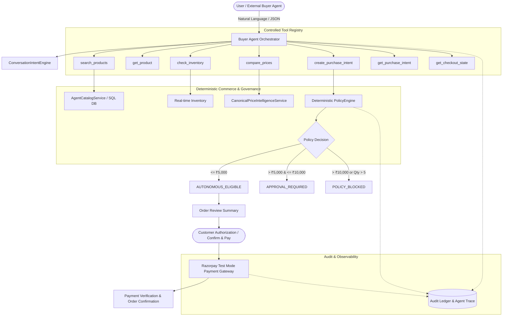

# Apex Store — Agent Commerce & AI Buyer Agent Architecture

## 1. Overview & Architecture

Apex Store provides an authoritative, machine-readable, transaction-ready commerce interface designed for external autonomous AI agents, multi-agent networks, and conversational buyer assistants.

The architecture strictly decouples **natural language reasoning** from **authoritative transaction facts**:
- **NLU / AI Layer**: Interprets natural language queries, parses constraints, and provides factual human-readable explanations.
- **Deterministic Commerce Layer**: Owns catalog truth, inventory, prices, discounts, governance policies, and Razorpay payment verification.
- **Security Boundary**: AI agents autonomously discover, search, filter, select, and prepare transactions, but **customer payment authorization is always explicit** unless governed by server-side policy delegation.



---

## 2. Agent Catalog API Contract

The catalog contract is accessible under `/api/v1/agent/...`:

### Endpoints
| Method | Endpoint | Access Level | Description |
|---|---|---|---|
| `GET` | `/api/v1/agent/catalog` | `PUBLIC_READ` | Machine-readable paginated catalog with structured variants and buyability. |
| `GET` | `/api/v1/agent/products/{product_id}` | `PUBLIC_READ` | Full product detail, first-class variants, canonical identity, and constraints. |
| `POST` | `/api/v1/agent/search` | `PUBLIC_READ` | Structured search applying hard constraints (budget, brand, category, variants) before ranking. |
| `GET` | `/api/v1/agent/products/{product_id}/availability` | `PUBLIC_READ` | Authoritative real-time stock and buyability check across all variants. |
| `GET` | `/api/v1/agent/tools` | `PUBLIC_READ` | Machine inspection endpoint returning active tool definitions and schemas. |
| `POST` | `/api/v1/agent/buyer/act` | `PUBLIC / AUTH` | Multi-turn conversational buyer agent reasoning and transaction preparation. |
| `POST` | `/api/v1/agent/purchase-intent` | `AUTHENTICATED_CUSTOMER` | Creates an immutable server-authoritative PurchaseIntent and evaluates governance. |
| `GET` | `/api/v1/agent/purchase-intent/{id}` | `AUTHENTICATED_CUSTOMER` | Retrieves purchase intent details and governance status (tenant-isolated). |

### Product Response Schema Example
```json
{
  "product_id": "prod_nike_running_01",
  "merchant_id": "mer_apex_sports",
  "name": "Pro Running Shoes",
  "description": "High-performance athletic running footwear with responsive cushioning.",
  "brand": "Nike",
  "category": "Footwear",
  "subcategory": "Running",
  "currency": "INR",
  "price": 3499.00,
  "mrp": 4999.00,
  "availability": "in_stock",
  "inventory_available": true,
  "stock_quantity": 42,
  "variants": [
    {
      "variant_id": "Black-UK9",
      "display_name": "Pro Running Shoes (Black - UK 9)",
      "color": "Black",
      "size": "UK 9",
      "style_code": "CW1777-001",
      "gtin": "00194500874523",
      "price": 3499.00,
      "mrp": 4999.00,
      "currency": "INR",
      "availability": "in_stock",
      "inventory_available": true,
      "stock_quantity": 18,
      "garment_asset": "https://images.unsplash.com/photo-1542291026-7eec264c27ff",
      "vto_eligible": false
    }
  ],
  "agent_buyable": true,
  "agent_buyability_reason": null,
  "purchase_constraints": {
    "max_order_quantity": 5,
    "requires_approval_above": 5000.0,
    "policy_blocked_above": 10000.0,
    "allowed_currency": "INR",
    "supported_payment_provider": "RAZORPAY_TEST_MODE"
  },
  "canonical_identity": {
    "brand": "Nike",
    "model": "Air Zoom Pegasus",
    "style_code": "CW1777-001",
    "gtin": "00194500874523",
    "verified": true
  }
}
```

---

## 3. Controlled Buyer Agent Tool Registry

Every tool is strictly registered with an input schema, output schema, required permission, authorization level, and side-effect flag:

| Tool Name | Side Effect | Authorization | Purpose |
|---|---|---|---|
| `search_products` | `false` | `PUBLIC` | Executes search applying hard constraints before ranking. |
| `get_product` | `false` | `PUBLIC` | Retrieves full product metadata, variants, and canonical style identity. |
| `check_inventory` | `false` | `PUBLIC` | Real-time authoritative inventory verification. |
| `compare_prices` | `false` | `PUBLIC` | Verified multi-retailer price comparison. |
| `create_purchase_intent` | `true` | `AUTHENTICATED_CUSTOMER` | Creates immutable purchase intent and triggers policy engine evaluation. |
| `get_purchase_intent` | `false` | `AUTHENTICATED_CUSTOMER` | Retrieves purchase intent details and governance status. |
| `get_checkout_state` | `false` | `AUTHENTICATED_CUSTOMER` | Validates order review and checkout payment readiness. |

---

## 4. Hard Constraints & Deterministic Ranking

When handling user prompts like `"Find Nike running shoes under ₹5,000"`:
1. **Hard Filters Applied First**:
   - `budget_max <= 5000`
   - `brand == "Nike"`
   - `category == "Footwear / Running"`
   - `inventory_available == true`
2. **Deterministic Ranking**: Products meeting all hard constraints are scored by relevance and price.
3. **Factual Explanation**: Explanations are strictly composed from verified product attributes without LLM hallucination.

---

## 5. Governance & Policy Engine Integration

Every transaction passes through the deterministic `PolicyEngine`:
- **Tier 1: $\le$ ₹5,000**: `AUTONOMOUS_ELIGIBLE` (Direct checkout with customer confirmation).
- **Tier 2: \> ₹5,000 and $\le$ ₹10,000**: `APPROVAL_REQUIRED` (Requires merchant/customer dual authorization).
- **Tier 3: \> ₹10,000 or Quantity > 5**: `POLICY_BLOCKED` (Strictly rejected by policy engine).

---

## 6. Payment & Audit Traceability

- **Razorpay Test Mode**: The server owns the final transaction amount. Client-supplied price tampering or fake payment markers are strictly rejected.
- **Trace Logging**: Every buyer interaction generates a unique `trace_id` recording events in the immutable audit ledger:
  - `BUYER_REQUEST_RECEIVED`
  - `INTENT_RESOLVED`
  - `CATALOG_SEARCHED`
  - `PRODUCT_SELECTED`
  - `INVENTORY_VALIDATED`
  - `PURCHASE_INTENT_CREATED`
  - `GOVERNANCE_EVALUATED`
  - `PAYMENT_CREATED`
  - `PAYMENT_VERIFIED`
  - `ORDER_CONFIRMED`
