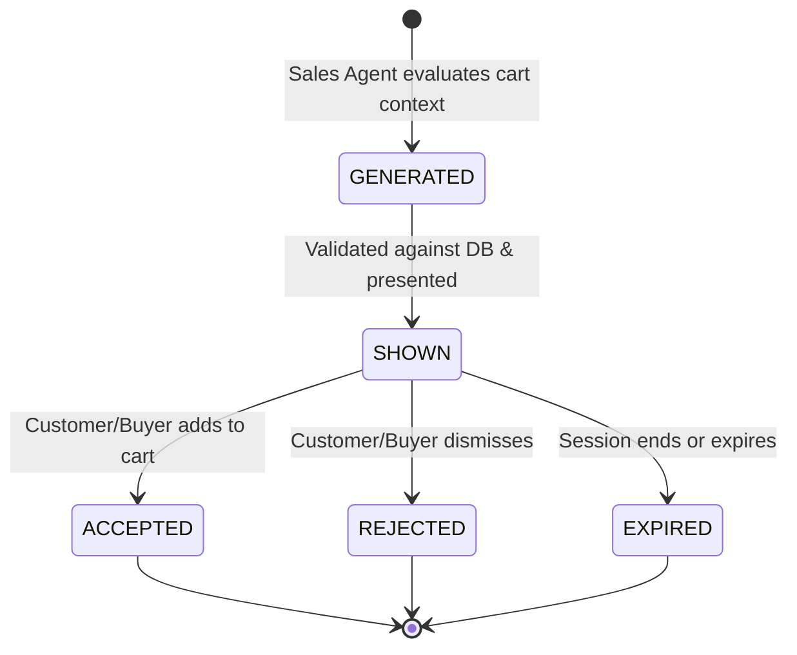

# AI-to-AI Commerce, Sales Agent & Purchase Intent

## 1. AI Buyer Architecture
The **AI Buyer** is an autonomous or assistant-driven buyer persona that communicates shopping requirements to the merchant. The AI buyer may submit natural language requests ("I need lightweight running shoes under ₹4,000") or structured protocol payloads:

```json
{
  "type": "SHOPPING_REQUEST",
  "buyer_id": "buyer_001",
  "session_id": "sess_buyer_001",
  "message": "I need running shoes under 4000",
  "constraints": {
    "max_price": 4000.0,
    "currency": "INR",
    "quantity": 1,
    "category": "Running"
  }
}
```

The merchant-side system treats the AI Buyer as an untrusted client: all constraints, quantities, and requirements are validated server-side.

---

## 2. Merchant Shopping Agent
The **Merchant Shopping Agent** interprets buyer requirements and queries the merchant's authoritative product catalog using permissioned tools:
- `search_products`: Queries active catalog items within buyer constraints.
- `add_to_cart`: Adds selected items to the merchant's authoritative cart session.
- `get_cart`: Returns the server-computed cart line items and total.

Authoritative product facts (actual prices, stock availability, category taxonomy) are retrieved solely from the merchant database.

---

## 3. Sales Agent
The **Sales Agent** (`sales_agent.py`) is a merchant-side agent focused on discovering contextual upsell and cross-sell opportunities to increase merchant sales volume while delivering value to the buyer.

### Permissions
- Scoped strictly to: `READ_PRODUCTS`, `READ_INVENTORY`, `READ_CART`.
- Forbidden: `MODIFY_CART`, `MODIFY_PRICE`, `CREATE_PAYMENT_ORDER`, `REFUND`, `OVERRIDE_POLICY`.

### Spam & Quality Controls
- Maximum 1–2 recommendations per decision.
- Never recommends products already present in the user's cart.
- Never recommends products already shown, accepted, or dismissed in the current session.
- Never recommends out-of-stock or inactive products.

---

## 4. Recommendation Lifecycle
Recommendations move through a deterministic state machine:



### Recommendation Acceptance
When a recommendation is accepted (`POST /api/v1/ai/recommendations/{id}/accept`):
1. The backend re-validates the product's active status and inventory in the database.
2. The product is added to the cart using the database's authoritative price.
3. The server recalculates the cart total.
4. The recommendation status transitions to `ACCEPTED`.

---

## 5. Structured Purchase Intent
A **Purchase Intent** represents what the AI buyer wants to purchase.

### Statuses
- `DRAFT`
- `CREATED` (Default initial status upon valid creation)
- `VALIDATED` (Evaluated by Phase 4 Policy Engine)
- `REJECTED` (Rejected by Policy Engine or user)
- `EXPIRED` (Expired after configurable period, default 15 minutes)
- `CONVERTED` (Completed in Phase 5 Payment Execution)

### Model Schema
- `id`: Unique UUID
- `merchant_id`: Scoped merchant identifier
- `buyer_id`: Buyer identifier
- `session_id`: Shopping session
- `cart_id`: Reference to authoritative cart
- `status`: Lifecycle state (`CREATED`)
- `currency`: ISO currency code (`INR`)
- `requested_amount`: Deterministic server-calculated sum
- `product_summary`: Snapshot of items, quantities, and prices
- `constraints`: Buyer-specified budget/constraints
- `trace_id`: Distributed observability trace
- `expires_at`: Expiration timestamp (`created_at + 15 mins`)

---

## 6. Authoritative Data Validation
The system guarantees that commerce facts are always authoritative:
1. **Price Integrity**: Prices are retrieved directly from `Product.price`. Client-provided prices (e.g. attempting to pay ₹1 for a ₹3,499 item) are completely ignored.
2. **Inventory Verification**: Cart items and purchase intents are checked against `Inventory.stock_quantity`.
3. **Budget Validation**: If `max_price` is provided by the buyer, `calculated_cart_total <= max_price` is strictly enforced.
4. **Tenant Isolation**: All operations verify `merchant_id` ownership to prevent cross-merchant data leakage.

---

## 7. Security Boundaries
| Capability | AI Buyer | Shopping Agent | Sales Agent | Purchase Intent Service |
| :--- | :---: | :---: | :---: | :---: |
| Search Catalog | Request only | Allowed (READ) | Allowed (READ) | N/A |
| Suggest Cross-Sell | N/A | N/A | Allowed (READ) | N/A |
| Add to Cart | Request only | Tool (MODIFY_CART) | ❌ Forbidden | N/A |
| Calculate Total | ❌ Untrusted | Deterministic Tool | ❌ Forbidden | Server Authoritative |
| Create Purchase Intent | Request only | N/A | ❌ Forbidden | Server Authoritative |
| Authorize Payment | ❌ Forbidden | ❌ Forbidden | ❌ Forbidden | ❌ Forbidden (Phase 4) |
| Execute Razorpay Charge | ❌ Forbidden | ❌ Forbidden | ❌ Forbidden | ❌ Forbidden (Phase 5) |

---

## 8. Separation of Purchase Intent from Payment
Why Purchase Intent is distinct from Payment Authorization:
1. **Commerce Intent ≠ Financial Authority**: An AI agent or buyer expressing desire to buy something does not imply merchant authorization or fund availability.
2. **Policy Verification (Phase 4)**: Financial policy rules (spending limits, velocity limits, manager approval rules, risk scores) evaluate whether the intent *should* be permitted.
3. **Payment Execution (Phase 5)**: Payment gateways (Razorpay order creation, customer checkout, signature verification) execute the financial settlement.

---

## 9. Example AI-to-AI Commerce Trace

```
1. [AI Buyer] -> POST /api/v1/ai/buyer/request
   { "message": "I need running shoes under ₹4,000", "constraints": { "max_price": 4000 } }

2. [Shopping Agent] -> search_products(query="Running", max_price=4000)
   <- DB: [Product(name="Pro Running Shoes", price=3499, stock=50)]

3. [AI Buyer / User] -> add_to_cart(product_id="prod_shoes", quantity=1)
   <- Cart: [Pro Running Shoes: ₹3,499] | Total: ₹3,499

4. [Sales Agent] -> Evaluates Cart Context (Shoes in cart)
   -> Generates Recommendation: Performance Socks (₹399)
   -> Validation: in_stock=200, active=True, not_in_cart=True
   <- Recommendation(status="SHOWN", price=399, confidence=0.88)

5. [AI Buyer / User] -> POST /api/v1/ai/recommendations/{id}/accept
   <- DB validation passed -> Added to Cart
   <- Cart: [Pro Running Shoes: ₹3,499, Performance Socks: ₹399] | Total: ₹3,898

6. [AI Buyer] -> POST /api/v1/ai/purchase-intents
   <- Server Cart Calculation: ₹3,499 + ₹399 = ₹3,898
   <- Validation: ₹3,898 <= ₹4,000 (Budget constraint satisfied)
   <- Created PurchaseIntent(id="PI-99120", status="CREATED", amount=3898, expires_at="+15min")
```
