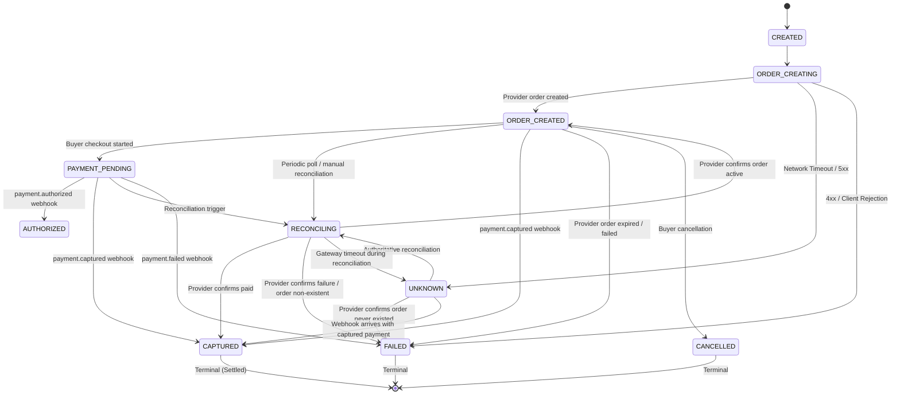
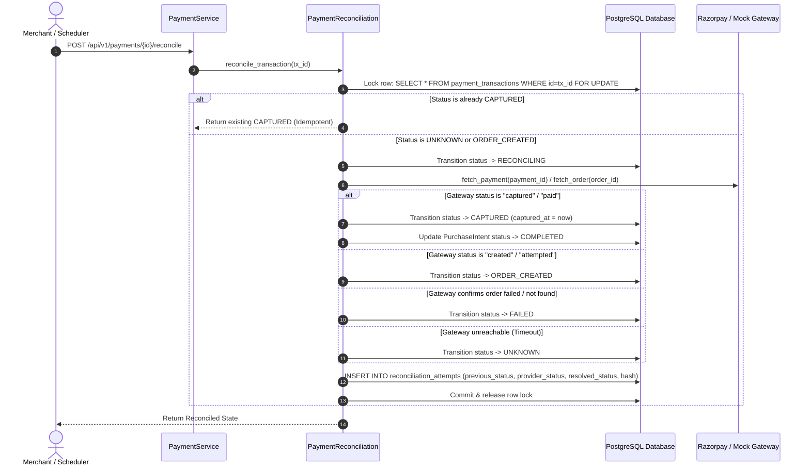

# Phase 6 — Failure Recovery, Reconciliation & Payment Simulator Architecture

## 1. Overview & Core Principles

In an enterprise-grade agentic payment OS, external payment providers are inherently subject to network drops, transient timeouts, gateway 5xx errors, and delayed out-of-order webhook deliveries.

The foundational principle of Phase 6 is:
$$\mathbf{UNKNOWN \ne FAILED}$$

`UNKNOWN` means: **"The external gateway's final state is ambiguous."**

### Core Safety Invariants
1. **No Blind Retries on `UNKNOWN`**: When an order creation or status query times out, the local transaction transitions to `UNKNOWN`. Creating another payment order against the same authorization is **strictly blocked** (HTTP 409 Conflict) until authoritative reconciliation resolves whether a provider-side order exists.
2. **Reconciliation Never Creates Orders**: Authoritative reconciliation queries gateway ground truth (`fetch_order`, `fetch_payment`) and resolves state transitions. It **never** blindly creates a new order.
3. **Idempotency Bound to Logical Transaction**: The idempotency key remains permanently bound to the logical transaction $T_1$. Network failures never cause silent creation of an orphaned $T_2$.
4. **Terminal State Immunity**: Settled states (`CAPTURED`) cannot be downgraded by delayed or out-of-order `payment.failed` webhooks.
5. **Simulator Sandboxing**: The Failure Simulator operates strictly against `MockPaymentProvider` and is hard-blocked (`HTTP 403 Forbidden`) in production environments (`ENVIRONMENT=production`).

---

## 2. Failure Classification & Taxonomy

| Failure Category | Trigger Condition | Immediate State | Recovery Action |
| :--- | :--- | :--- | :--- |
| **`TIMEOUT`** | Network timeout during order creation | `UNKNOWN` | Transition to `UNKNOWN`, record `PaymentAttempt(status=TIMEOUT)`, block retries, trigger reconciliation. |
| **`CONNECTION_ERROR`** | Network socket dropped or refused | `UNKNOWN` | Transition to `UNKNOWN`, record attempt, trigger reconciliation. |
| **`PROVIDER_5XX`** | Gateway returns 500/502/503/504 | `UNKNOWN` | Ambiguous whether provider created order; trigger reconciliation. |
| **`UNKNOWN_PROVIDER_STATE`**| Partial response received / unclassified error | `UNKNOWN` | Preserve existing `provider_order_id`, reconcile existing order without creating new order. |
| **`PROVIDER_4XX`** | Bad Request, authentication failure, invalid payload | `FAILED` | Definitively rejected before provider order creation; no retry. |
| **`VALIDATION_ERROR`** | Schema mismatch, currency mismatch, amount tampering | `FAILED` | Rejected pre-provider by `AuthorizationService`; 400 Bad Request. |
| **`AUTHORIZATION_ERROR`** | Expired, revoked, or non-existent authorization | `FAILED` | Rejected pre-provider; 400 Bad Request. |
| **`RECONCILIATION_ERROR`**| Provider unreachable during reconciliation | `UNKNOWN` | Retain `UNKNOWN`, schedule retry. |

---

## 3. State Machine & Lifecycle Transitions



---

## 4. Authoritative Reconciliation Flow



---

## 5. Audit Record Schemas

### `PaymentAttempt`
Tracks every outbound provider call (order creation, fetch, capture) with millisecond-precision timestamps:
- `id`: UUID
- `merchant_id`: String (Indexed)
- `payment_transaction_id`: String (Foreign Key)
- `attempt_number`: Integer
- `provider`: `"mock"` | `"razorpay"`
- `operation`: `"CREATE_ORDER"` | `"FETCH_ORDER"` | `"FETCH_PAYMENT"` | `"WEBHOOK_CAPTURE"`
- `idempotency_key`: String (Indexed)
- `request_fingerprint`: SHA-256 hash of outbound payload
- `status`: `"STARTED"` | `"SUCCESS"` | `"TIMEOUT"` | `"FAILED"` | `"PROVIDER_ERROR"`
- `provider_order_id`, `provider_payment_id`: Optional gateway references
- `error_code`, `error_message`: Categorized failure attributes
- `trace_id`: Observability correlation ID
- `started_at`, `completed_at`: Timestamps

### `ReconciliationAttempt`
Tracks every state resolution and gateway inspection:
- `id`: UUID
- `merchant_id`: String (Indexed)
- `payment_transaction_id`: String (Foreign Key)
- `attempt_number`: Integer
- `previous_status`: e.g. `"UNKNOWN"`
- `provider_status`: e.g. `"captured"`
- `resolved_status`: e.g. `"CAPTURED"`
- `reason`: Descriptive outcome rationale
- `provider_response_hash`: SHA-256 hash of raw provider response
- `started_at`, `completed_at`: Timestamps

---

## 6. Failure Simulator & Security Controls

The Payment Simulator allows developers and QA teams to inject edge-case failure scenarios into the live backend pipeline without compromising production safety.

### Simulator Scenarios
1. **`TIMEOUT`**: Injects simulated gateway network drop during order creation $\rightarrow$ transitions `PaymentTransaction` to `UNKNOWN` and logs `PaymentAttempt(TIMEOUT)`.
2. **`PROVIDER_4XX`**: Injects 400 Bad Request client rejection $\rightarrow$ transitions `PaymentTransaction` to `FAILED`.
3. **`OUT_OF_ORDER_WEBHOOK`**: Delivers a simulated `payment.failed` event on a transaction that is already `CAPTURED` $\rightarrow$ verifies that state machine prevents downgrades.
4. **`INVALID_WEBHOOK_SIGNATURE`**: Delivers forged payload $\rightarrow$ verifies 401 Unauthorized response over raw request body.
5. **`SUCCESS`**: Standard simulated order creation.

### Production Environment Sandbox
```python
if settings.ENVIRONMENT == "production":
    raise HTTPException(status_code=403, detail="Failure simulator is strictly disabled in production environments.")
```

---

## 7. PostgreSQL Concurrency & Row-Level Locking

For high-throughput payment architectures:
- **`with_for_update()`**: Used during reconciliation to prevent race conditions between simultaneous polling threads and inbound webhooks.
- **Unique Database Constraints**: `(merchant_id, idempotency_key)` and `(event_id)` prevent duplicate payment creation and duplicate webhook processing at the database layer.
- **Deterministic Convergence**: Simultaneous webhook and reconciliation requests safely converge to `CAPTURED` without duplicate state mutations.
