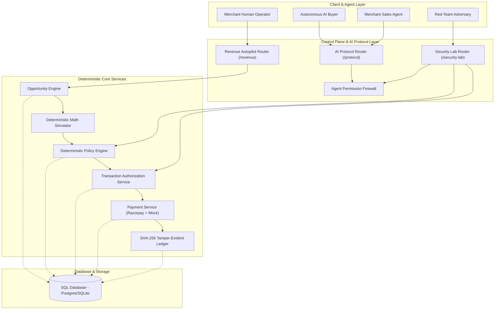

# Phase 9 Architecture — Revenue Autopilot & Red-Team Security Lab

## 1. Executive Summary

Phase 9 completes the transformation of the **Agentic Commerce OS** into a dual-engine fintech control plane:
1. **Merchant Revenue Autopilot**: A proactive growth engine discovering high-affinity catalog opportunities (cross-sells, bundles, clearance campaigns), generating AI proposals, deterministically simulating margin impact, and executing campaigns safely under merchant policy boundaries.
2. **AI Red-Team Security Lab**: An embedded adversarial security harness validating 12 attack vectors (price tampering, prompt injection, privilege escalation, cross-tenant leaks, webhook forgery, state machine bypass) against live production endpoints.

---

## 2. Full System Architecture

---

## 3. Database Schema Additions

### `revenue_opportunities` Table
- `id`: Primary key (UUID string)
- `merchant_id`: Foreign key to `merchants.id`
- `type`: `CROSS_SELL`, `UPSELL`, `BUNDLE`, `CAMPAIGN`
- `source_product_id`: Source reference product
- `target_product_ids`: JSON array of target products
- `title`, `description`, `reason`: Campaign copy & explanation
- `confidence`: AI affinity score ($0.0 \dots 1.0$)
- `proposed_discount_percent`: Decimal percentage
- `estimated_incremental_orders`: Projected volume
- `estimated_incremental_gmv`: Decimal projected GMV
- `estimated_discount_cost`: Decimal discount subsidy cost
- `estimated_net_value`: Decimal net commercial benefit
- `risk_level`: `LOW`, `MEDIUM`, `HIGH`
- `status`: `GENERATED`, `SIMULATED`, `PENDING_APPROVAL`, `APPROVED`, `REJECTED`, `EXECUTED`
- `simulation_payload`: JSON dump of simulation parameters
- `approved_by_user_id`, `approved_at`, `executed_at`, `trace_id`

### `security_attack_results` Table
- `id`: Primary key (UUID string)
- `merchant_id`: Foreign key to `merchants.id`
- `scenario_id`: Attack scenario identifier
- `scenario_name`: Human-readable attack title
- `category`: Attack categorization
- `attempted_payload`: JSON redacted attack parameters
- `expected_result`: Expected containment status
- `actual_result`: Live execution status
- `blocked`: Boolean flag indicating attack containment
- `block_layer`: Architectural defense layer
- `reason`: Explanation of defense mechanism
- `trace_id`: Correlated audit trace identifier
- `executed_at`: Timestamp

---

## 4. Verification Summary

- **Backend Pytest Suite**: 109 passed, 5 honestly skipped (infrastructure-dependent), 0 failed.
- **Frontend Production Build**: 19 static routes compiled cleanly with 0 TypeScript/ESLint errors.
- **Live Demo Script**: All 4 demonstration phases executed with 100% security pass rate.
